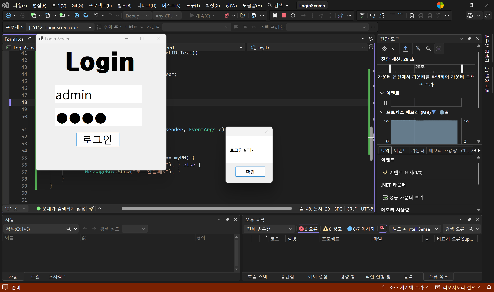
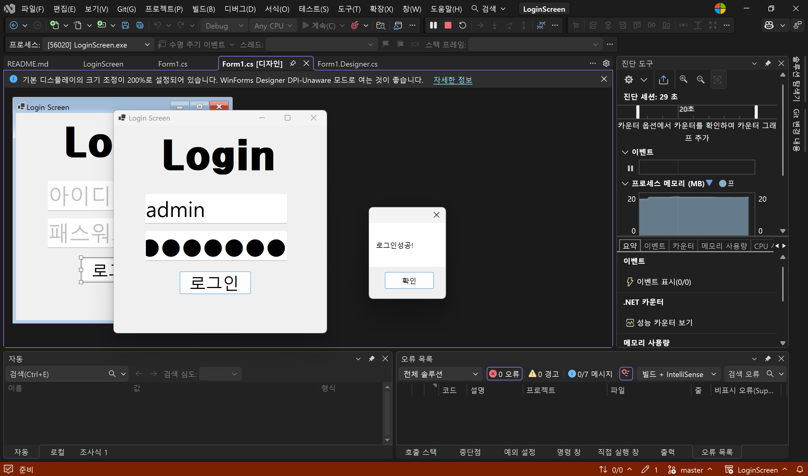
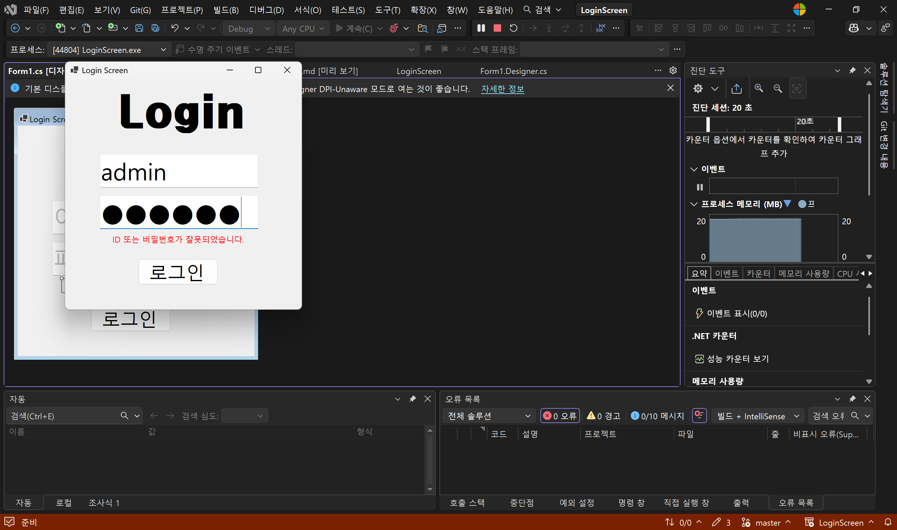
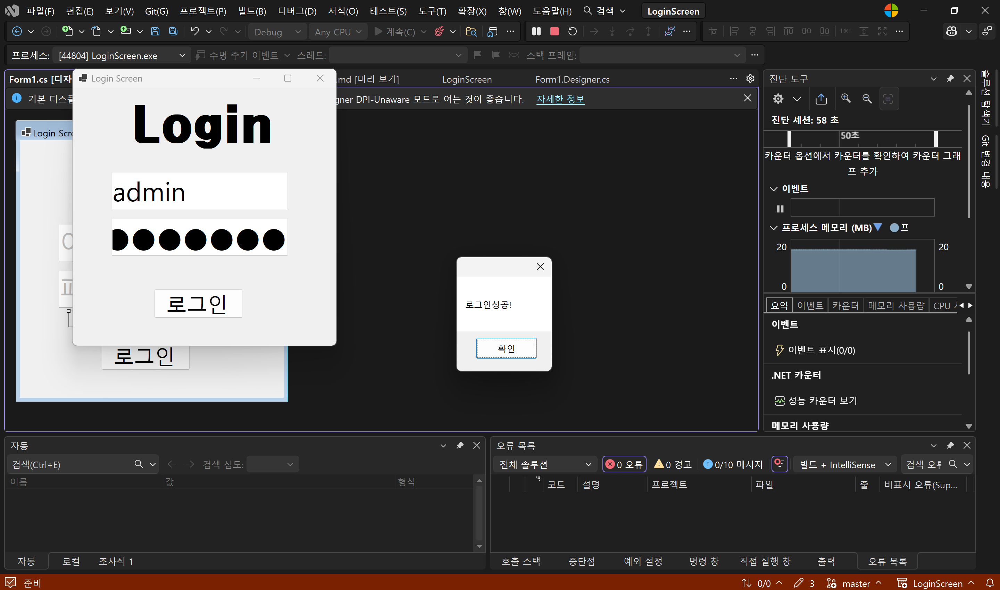

# (C# 코딩) 로그인 스크린

## 개요
- C# 프로그래밍 학습 로그인스크린
- 1줄 소개 : 사용자의 아이디와 패스워드를 입력받는 로그인 화면
- 사용한 플랫폼 :  
	- C#, .NET Windows Forms, Visual Studio, GitHub
- 사용한 컨트롤 : 
	- label, textbox, button, messagebox 등
- 사용한 기술과 구현한 기능 : 
	- visual studio를 이용하여 UI 디자인
	- 패스워드 입력 내용을 숨기는 기능 구현 
	- tab을 이용한 입력 포커스 제어
	- Placeholder 기능 구현
 
## 실행화면 (과제1)
- 과제1 코드의 실행 스크린샷 

- 과제내용
	- label, textbox, button의 위치와 크기를 적절히 조절하여 로그인 스크린 디자인하기
	- 텍스트박스에 placeholder 기능 구현합니다.
	- 아이디와 패스워드 입력 받아 확인합니다.
	- 아이디와 패스워드의 텍스트박스에 입력 안내 메시지(힌트 텍스트) 표시합니다.
	- 패스워드 입력 내용이 보이지 않도록 하는 기능 구현합니다
	- tab키를 이용해서 입력 포커스가 아이디 입력창, 패스워드 입력창, 로그인 버튼 순서로 이동하도록 구현합니다.
	- 로그인 버튼을 클릭하면 아이디와 패스워드가 일치하는지 확인하는 기능 구현합니다.

- 구현 내용과 기능 설명
	- 처음 실행 시 입력 포커스가 버튼으로 가도록 조정
	- 아이디와 패스워드를 입력 받는 창에는 안내 문구가 표시되도록 구현.
	- 패스워드 입력창은 입력한 내용이 보이지 않도록 설정
	- 텍스트 박스에 입력 포커스가 있으면 입력 안내 메시지를 없앰.
	- 아이디와 패스워드가 모두 맞으면 로그인 성공 메시지 박스 띄우는 기능 구현
	- 아이디와 패스워드 중 하나라도 틀리면 로그인 실패 메시지 박스 띄우는 기능 구현

## 실행화면 (과제2)
- 과제2 코드의 실행 스크린샷 

- 과제내용
	- 아이디를 입력하고 enter 누르면 패스워드 입력창으로 이동
	- 패스워드 입력하고 enter 누르면 로그인 버튼이 클릭되도록 구현
	- 라벨을 visible 속성을 이용해서 로그인 실패 메시지를 표시하도록 구현
	- 아이디와 패스워드 중 하나라도 틀리면 ("아이디 또는 비밀번호가 잘못 되었습니다.") 라는 메시지 박스를 띄우도록 구현. 
- 구현 내용과 기능 설명
	- enter키 입력을 받기 위한 이벤트 핸들러 추가
	- 아이디 입력창에서 enter키 입력 시 패스워드 입력창으로 포커스 이동
	- 패스워드 입력창에서 enter키 입력 시 로그인 버튼 클릭 이벤트 발생
	- 로그인 실패 시 라벨의 visible 속성을 true로 설정하여 실패 메시지("아이디 또는 비밀번호가 잘못 되었습니다.") 표시 